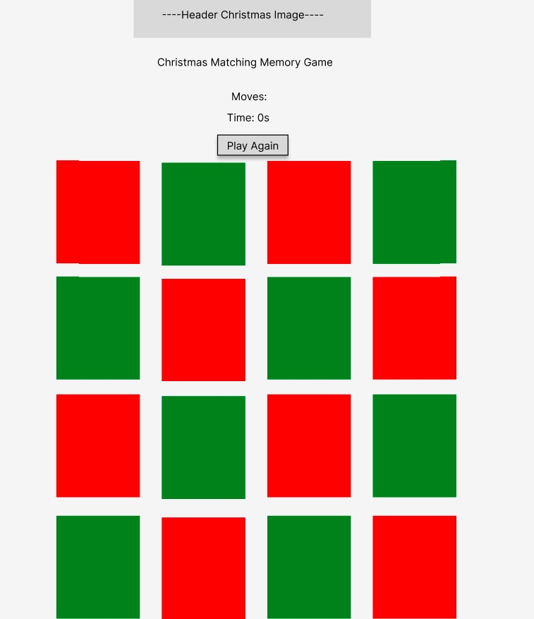
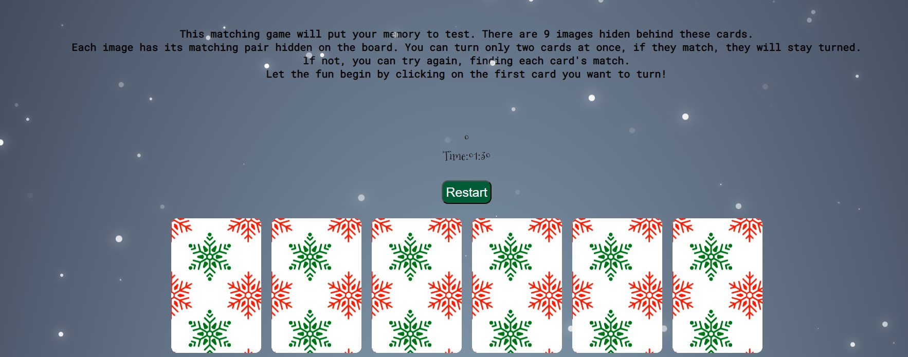
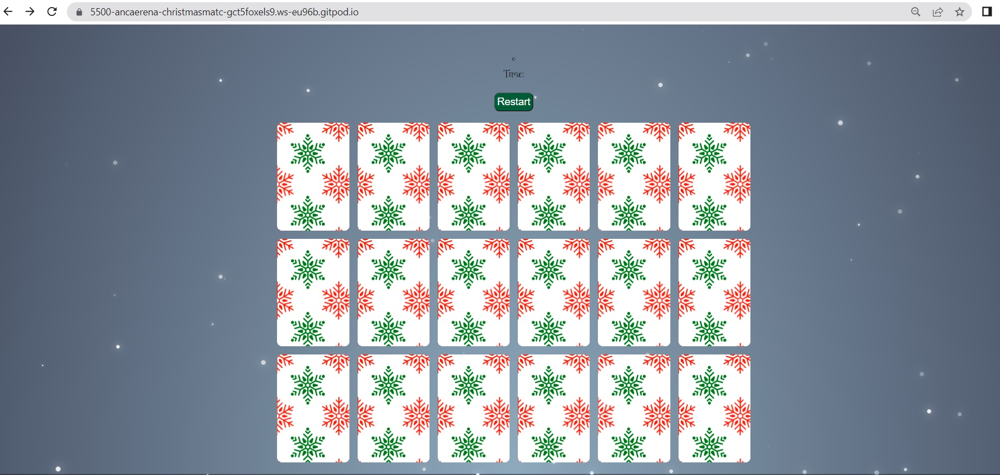
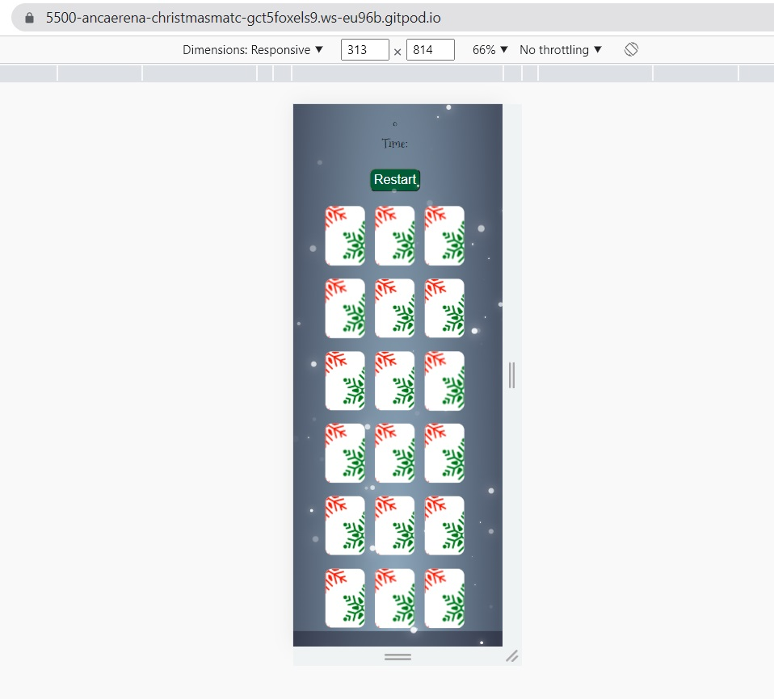
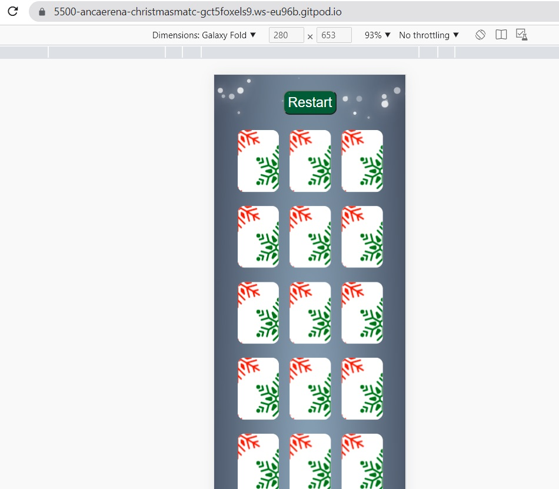
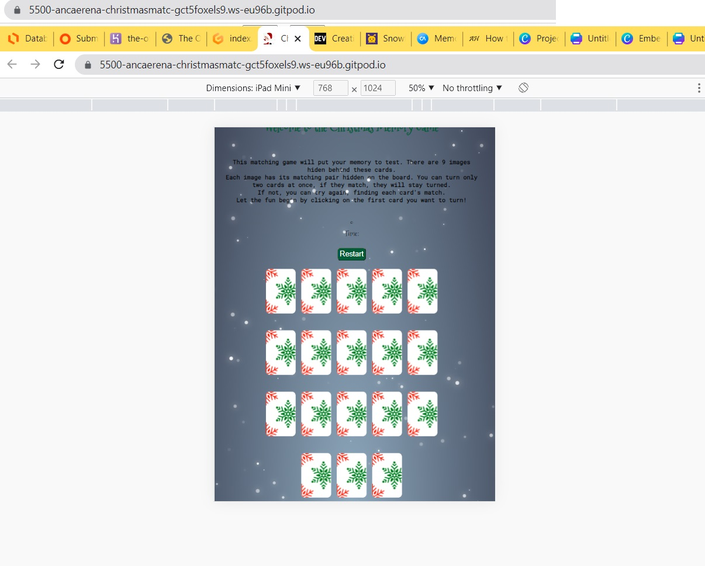

<h1>Christmas Memory Game</h1>
 
 

The Christmas Memory Game is a fun activity around Christmas time. Can be played by adults and children as well. The game improves memory and focus while also having fun discovering different images.
 
As memory is one of the most important asset of a human being, users will gain valuable skills while playing this game. 

 

 
<h2>Features</h2>
 
 - To structure the game's layout, I have used Figma to create the wireframe for the page:
  

 
<h3>Existing Features</h3>
 
<h4><strong>Header</strong></h4>
 
- It contains a Christmas related photo to enter into the atmosphere of the game.
It also states  the name of the game, in a font part of the Christmas theme.
 
- It also has the snow effect, for a winterwonderland feeling. The snow effect has a toggle button to be disabled in case users wish to not use the effect. 

 
<h4><strong>First section</strong></h4>
-It highlights the instructions on how to play the game, written in a happy, cheerful tone, to help users learn more about the game. It brings important information for the user. It clearly tells how to start and play the game. It also has a good contrast on the page.

 
<h4><strong>Statistics controls</strong></h4>
- A div that helps the user keep track of his score and time spend on the game. It registers the number of moves the user has and also the seconds he spent playing. A great way to compare between highscores with the same user or with different users if played with your family.
 
- The moves show up after the first 2 cards are turned, and the timer starts then as well.
 
- There's also a button to invite users to play the game again. The button will reset the timer and reload the page, with a brand new board. Cards are suffled each time the Restart button is pressed.
 

 
<h4><strong>Game section</strong></h4>
- Using Christmas color theme, this section contains the game itself. A board with 18 cards, 9 images that repeat themselves. Only two images can be turned at the same time. If they match, they will stay turned and the user can move on in finding the other pairs until the full board of cards is turned. 
 
- The front of the cards are showing snowflakes, in Christmas colours.
 
- The images on the other side of the cards are fun winter themed, with snow, snowman, Christmas Tree and Christmas presents, with kids, couples and families, making everything attractive and fun to play and discover.
 

 
- The board is created as a holder in HTML, images are stored in json files and fetched into JavaScrip, using the Fetch API method, which works good when having a local json file. 
 
- Other option for the json file to load is from a server, or to use import method. In this case, the Fetch API method worked well.
 
 
<h4>Java Script Functions</h4>
 
- The query selector was used to referance the html grid-container class
 
- The json file was fetched into the JavaScript using Fetch API method, returning a to convert into json file with res.json(). The data was then added to the "card" array.
 
- The shuffle the cards data helps to randomize the cards display, using the math method.
 
- The generate the cards function uses a for loop to iterate through the cards. The innerHTML property is used to display the back and the front of the cards.
 
- The flip function checks the status of lockBoard variable and flipes the cards to display their front face.  Each flip adds to the moves score, incrementing it and displaying it at the top of the page.
 
- The check for a match function uses an if statement to see if the name of the image match, if they do, the disableCards()  is called to allow for the cards to stay unflipped, if they don't, the unflipCards() is called.
 
- The resetBoard resets the board after each matching atempt, and restartGame function helps to restart the game,   shuffling the cards again for a new set, brining the score and the timer back to 0.
 
<h3>Features left to implement</h3>
 
<h4>Result message</h4> 
- A result message with the number of moves and the time spend to finish the game. Time to be displayed in minutes and seconds.
 
<h3>Fixed bugs</h3>
- Json file was not working in jaVascript. I moved the file into a public folder and change the source path for it to work.
 
- Screen responsivness was not working. It was the wrong name of the class in CSS for media query. 
 
- Cards unmatched to turn back on before the next click on the next card. This was fixed with setTimeout() function.
 
<h3>Bugs to be fixed</h3>
- Time to stop when all cards are flipped and game is won.
 
 
<h3>Testing</h3>
 
- I've tested that this website works in different browsers, Chrome, Edge and Safari
 
- I've tested and the website works in different devices, being responsive to them: mobile devices, tablets and 8 inch screens
 

 
- I confirm that the instructions are legible and easy to follow and the game is accesible to all ages, from 3 years old to over 100 years old, all would benefit from playing this game and improving their memory.
All images have text description.
 

 
<h3>Validator testing</h3>
 
<h4>HTML</h4>
 
-No errors were returned when passing through the official W3C validator, except the Toggle error, which can be ignored
 
<h4>CSS</h4>
 
-No errors were found when passing through the official (Jigsaw) validator
 
 
<h4>JavaScript</h4>
 
-No errors were found when passing through the official JSHint JavaScript Validator
 
- It resulted the following metrics:
 
There are 13 functions in this file.
 
Function with the largest signature take 1 arguments, while the median is 0.
 
Largest function has 12 statements in it, while the median is 3.
 
The most complex function has a cyclomatic complexity value of 4 while the median is 1.
 
 
<h2>Deployment</h2>
 
- The site was deployed to Github pages, the steps to deployment as follow:
 
A. In the Github repository, navigate to the Settings tab
 
B. From there, select Pages from the left side
 
C. From the source section drop-down menu select Main as a branch and then save
 
D. Once the main branch was selected, the page provided the link to the completed website
 
The live link can be found here: [Christmas Memory Game](https://github.com/ancaerena/christmas-match)
 
 
<h2>Credits</h2>
 
- My mentor Jubril Akolade for giving me advice regarding font style, game instructions and JavaScript hints and help
 
-While working in JavaScript, a great help was Stack Overflow, for answering questions about the timer in the game.
 
- Useful webpages I've navigated for answers: dev.to , freecodecamp.org, aldohadinata.com , codingartistweb.com
 
 
<h3>Content</h3>
 
- snow fall code source can be found here: [PureSnow](https://github.com/hyperstown/puresnowjs)
 
 
<h3>Media</h3>
 
- The header image was created in Canva by me  
- The fliped face of the cards were created in a mobile app called MomentsCam  
- The unfliped face of the cards were sourced from pattern.monster webpage  

