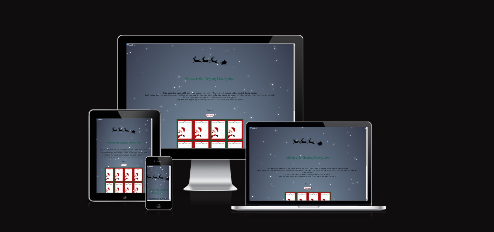
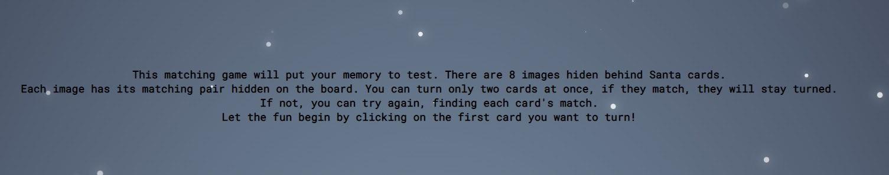
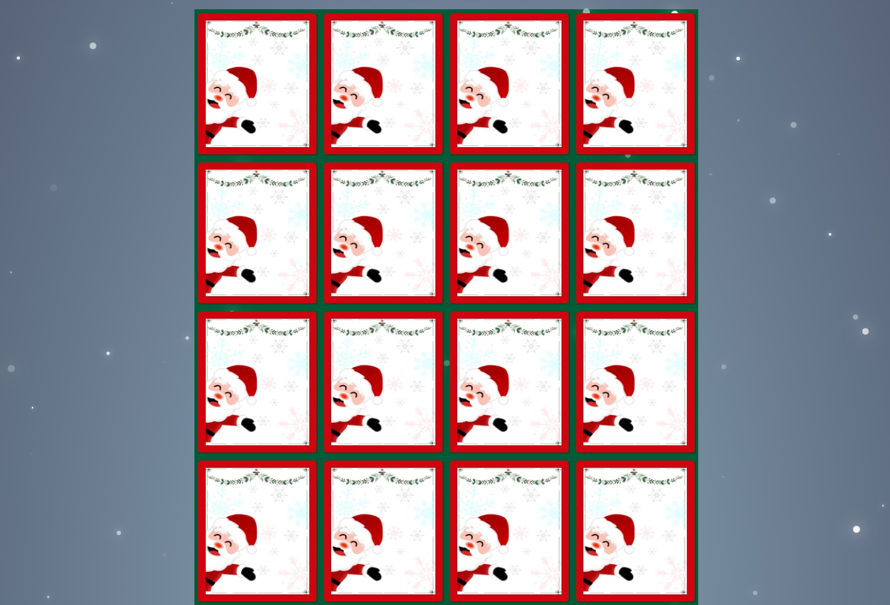
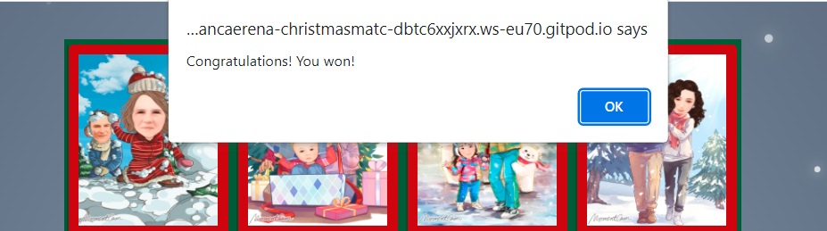
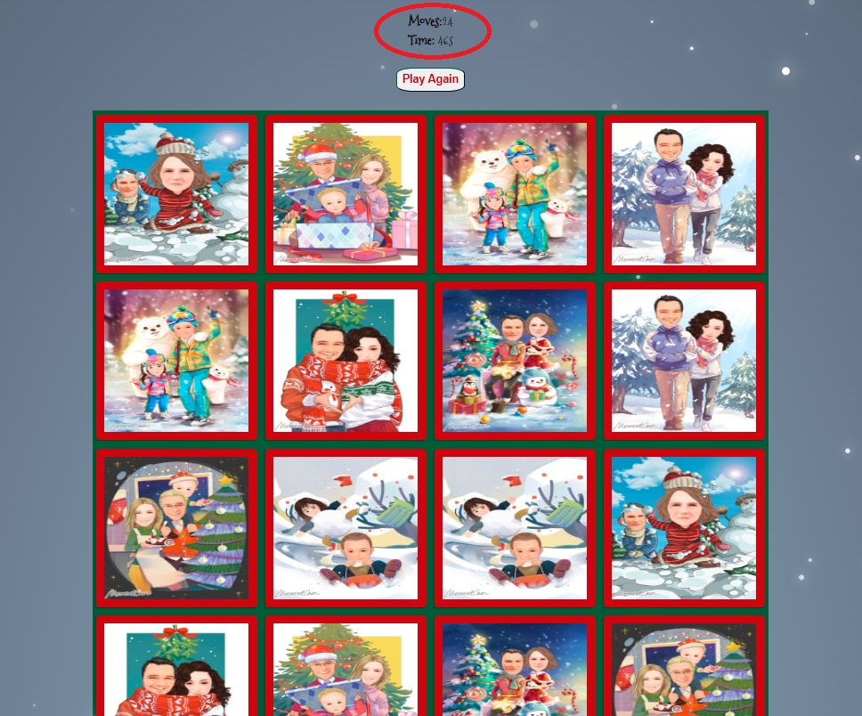
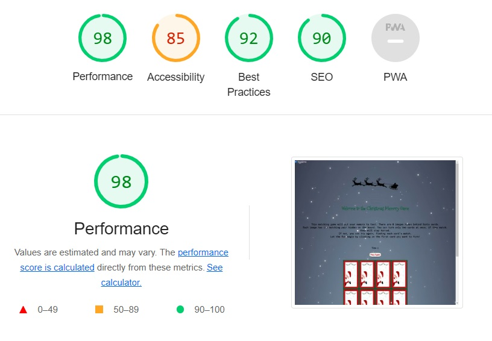

<h1>Christmas Memory Game</h1>
 
 

The Christmas Memory Game is a fun activity around Christmas time. Can be played by adults and children as well. The game improves memory and focus while also having fun discovering different images.
 
As memory is one of the most important asset of a human being, users will gain valuable skills while playing this game. 

 

 
<h2>Features</h2>

<h3>Existing Features</h3>
 
<h4><strong>Header</strong></h4>
 
- It contains a Christmas related photo to enter into the atmosphere of the game.
It also states  the name of the game, in a font part of the Christmas theme.
 
- It also has the snow effect, for a winterwonderland feeling. The snow effect has a toggle button to be disabled in case users wish to not use the effect. 

 
<h4><strong>First section</strong></h4>
-It highlights the instructions on how to play the game, written in a happy, cheerful tone, to help users learn more about the game. It brings important information for the user. It clearly tells how to start and play the game. It also has a good contrast on the page.

 
<h4><strong>Statistics controls</strong></h4>
- A div that helps the user keep track of his score and time spend on the game. It registers the number of moves the user has and also the seconds he spent playing. A great way to compare between highscores with the same user or with different users if played with your family.
 
- The moves show up after the first 2 cards are turned, but the timer starts the moment you open the page.
 
- There's also a button to invite users to play the game again. The button will reset the timer and reload the page, with a brand new board. Cards are suffled each time the Play Again button is pressed.
 

 
<h4><strong>Second section</strong></h4>
- Using Christmas color theme, this section contains the game itself. A board with 16 cards, 8 images that repeat themselves. Only two images can be turned at the same time. If they match, they will stay turned and the user can move on in finding the other pairs until the full board of cards is turned. 
 
- The front of the cards are showing a funny Santa Claus, peeping out, like playing hide and seek, which complements the idea of the game, encouraging the user to see what hides behind that card.
 
- The images on the other side of the cards are fun winter themed, with snow, snowman, Christmas Tree and Christmas presents, with kids, couples and families, making everything attractive and fun to play and discover.
 

 
<h4>The Message Alert</h4>
- Once the last card on the board is turned, a message will pop up, congratulating the user for wining the game. The user can then check how many moves they needed to finish the game and can work towards better scores by pressing the Play Again button.
 

 
 
<h3>Features left to implement</h3>
 
<h4>Result message</h4>
- A result message with the number of moves and the time spend to finish the game. Time to be displayed in minutes and seconds.
 
<h3>Bugs to be fixed</h3>
- Cards unmatched to turn back on before the next click on the next card.
 
<h3>Testing</h3>
 
- I've tested that this website works in different browsers, Chrome, Edge and Safari
 
- I've tested and the website works in different devices, being responsive to them: mobile devices, tablets and 8 inch screens
 
- I confirm that the instructions are legible and easy to follow and the game is accesible to all ages, from 3 years old to over 100 years old, all would benefit from playing this game and improving their memory.
All images have text description.
 

<h3>Validator testing</h3>
 
<h4>HTML</h4>
 
-No errors were returned when passing through the official W3C validator
 
<h4>CSS<h4>
 
-No errors were found when passing through the official (Jigsaw) validator
 
<h4>JavaScript<h4>
 
-No errors were found when passing through the official JSHint JavaScript Validator
 
- It resulted the following metrics:
 
There are 15 functions in this file.
 
Function with the largest signature take 1 arguments, while the median is 0.
 
Largest function has 10 statements in it, while the median is 2.
 
The most complex function has a cyclomatic complexity value of 4 while the median is 1.
 
<h2>Deployment</h2>
 
- The site was deployed to Github pages, the steps to deployment as follow:
 
A. In the Github repository, navigate to the Settings tab
 
B. From there, select Pages from the left side
 
C. From the source section drop-down menu select Main as a branch and then save
 
D. Once the main branch was selected, the page provided the link to the completed website
 
The live link can be found here: [Christmas Memory Game](https://github.com/ancaerena/christmas-match)
<h2>Credits</h2>
 
- My mentor Jubril Akolade for giving me advice regarding font style, game instructions and JavaScript hints and help
 
-While working in JavaScript, a great help was Stack Overflow, for answering questions about the timer in the game.
 
<h3>Content</h3>
 
- snow fall code source can be found here: [PureSnow](https://github.com/hyperstown/puresnowjs)
 
- JavaScript code for flipping cards can be found here: [Memory Game Repo](https://github.com/code-sketch/memory-game)
 
<h3>Media</h3>
 
- The header image and front cards image (with Santa Claus) were created in Canva by me
- The back face of the cards were created in a mobile app called MomentsCam

